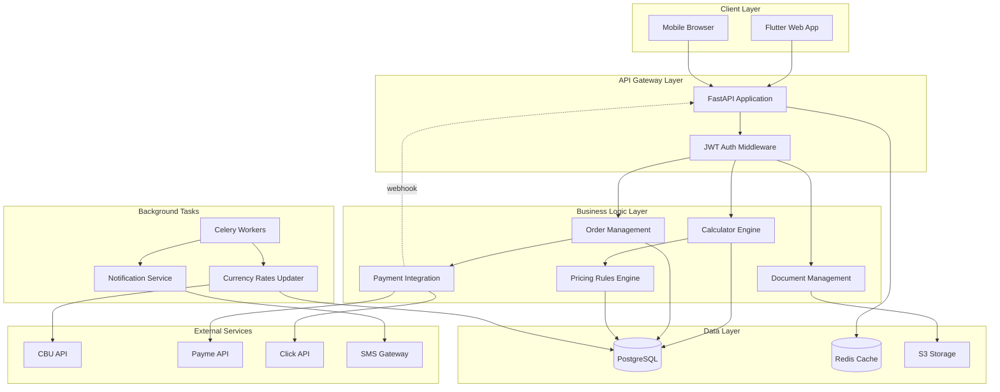
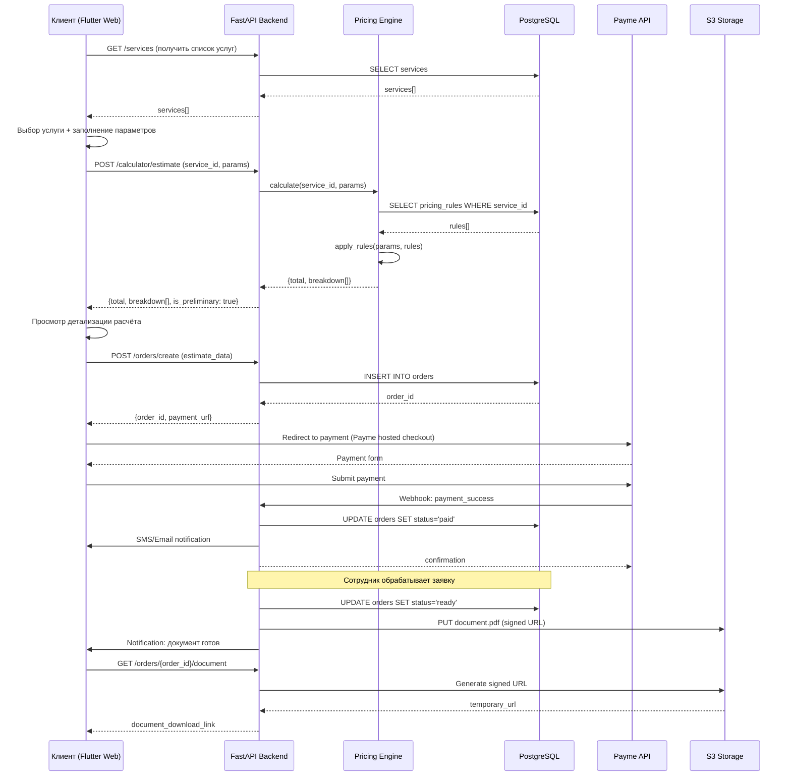

# Документ технического проектирования: Веб-сайт Business Standart

## Обзор

Новый веб-сайт для оценочной компании ООО «BUSINESS STANDART» (Ташкент, Узбекистан) — современная платформа в стиле cozy minimalist для предоставления оценочных услуг с интерактивным калькулятором стоимости, интеграцией карты районов, личным кабинетом клиента и приёмом онлайн-оплаты через Payme/Click.

Система заменяет устаревший сайт (Joomla 1.5) и добавляет ключевую функциональность: автоматизированный расчёт предварительной стоимости услуг на основе конфигурируемых правил ценообразования, прозрачную визуализацию расчётов, онлайн-оплату и отслеживание статуса заявок в реальном времени.

**Технологический стек**: Backend — Python/FastAPI, PostgreSQL, Celery/Redis; Frontend — Dart/Flutter Web; Платежи — Payme/Click Merchant API; Хранилище — S3-совместимое для PDF-документов.

**Язык интерфейса**: исключительно русский (все тексты, сообщения, уведомления).

## Архитектура системы



## Диаграмма последовательности: Основной сценарий калькулятора с оплатой




## Компоненты и интерфейсы

### Компонент 1: Pricing Engine (Движок расчёта стоимости)

**Назначение**: Вычисление предварительной стоимости оценочных услуг на основе конфигурируемых правил ценообразования с прозрачной детализацией.

**Интерфейс**:
```python
from typing import Dict, List, Any
from decimal import Decimal
from pydantic import BaseModel

class PricingRule(BaseModel):
    id: int
    service_id: int
    param_key: str
    rate_type: str  # 'linear' | 'tiered' | 'flat_addon'
    base_fee: Decimal
    tiers: List[Dict[str, Any]]  # для tiered: [{min: 0, max: 100, rate: 10000}, ...]

class EstimateBreakdown(BaseModel):
    item_name: str
    description: str
    amount: Decimal

class EstimateResult(BaseModel):
    total: Decimal
    breakdown: List[EstimateBreakdown]
    is_preliminary: bool = True
    currency: str = "UZS"

class PricingEngine:
    async def calculate_estimate(
        self,
        service_id: int,
        params: Dict[str, Any]
    ) -> EstimateResult:
        """Рассчитывает предварительную стоимость услуги"""
        pass
    
    async def get_pricing_rules(
        self,
        service_id: int
    ) -> List[PricingRule]:
        """Получает правила ценообразования для услуги"""
        pass
```

**Ответственности**:
- Загрузка правил ценообразования из БД по service_id
- Применение правил к входным параметрам (linear, tiered, flat_addon)
- Формирование детализированного breakdown расчёта
- Валидация входных параметров перед расчётом
- Кеширование правил ценообразования в Redis

### Компонент 2: Order Management (Управление заявками)

**Назначение**: Управление жизненным циклом заявок клиентов от создания до получения готового документа.

**Интерфейс**:
```python
from datetime import datetime
from enum import Enum

class OrderStatus(str, Enum):
    DRAFT = "draft"
    AWAITING_PAYMENT = "awaiting_payment"
    PAID = "paid"
    IN_PROGRESS = "in_progress"
    READY = "ready"
    DELIVERED = "delivered"
    CANCELLED = "cancelled"

class Order(BaseModel):
    id: int
    user_id: int
    service_id: int
    params: Dict[str, Any]
    estimate_total: Decimal
    status: OrderStatus
    created_at: datetime
    deadline: datetime | None
    document_url: str | None

class OrderManagement:
    async def create_order(
        self,
        user_id: int,
        service_id: int,
        params: Dict[str, Any],
        estimate_total: Decimal
    ) -> Order:
        """Создаёт новую заявку"""
        pass
    
    async def update_status(
        self,
        order_id: int,
        new_status: OrderStatus,
        actor_id: int
    ) -> Order:
        """Обновляет статус заявки с логированием"""
        pass
    
    async def attach_document(
        self,
        order_id: int,
        document_path: str
    ) -> str:
        """Загружает готовый документ в S3 и возвращает signed URL"""
        pass
    
    async def get_user_orders(
        self,
        user_id: int,
        status: OrderStatus | None = None
    ) -> List[Order]:
        """Получает заявки пользователя"""
        pass
```

**Ответственности**:
- Создание заявок на основе расчётов калькулятора
- Управление статусами заявок с аудит-логом
- Расчёт и отслеживание дедлайнов (2-5 рабочих дней)
- Интеграция с S3 для хранения PDF-документов
- Генерация временных подписанных ссылок на документы

### Компонент 3: Payment Integration (Интеграция платежей)

**Назначение**: Унифицированный интерфейс для приёма платежей через Payme и Click с обработкой webhook'ов.

**Интерфейс**:
```python
class PaymentProvider(str, Enum):
    PAYME = "payme"
    CLICK = "click"

class PaymentStatus(str, Enum):
    PENDING = "pending"
    SUCCESS = "success"
    FAILED = "failed"
    CANCELLED = "cancelled"

class PaymentTransaction(BaseModel):
    id: int
    order_id: int
    provider: PaymentProvider
    amount: Decimal
    status: PaymentStatus
    external_id: str
    created_at: datetime

class PaymentIntegration:
    async def create_payment(
        self,
        order_id: int,
        amount: Decimal,
        provider: PaymentProvider
    ) -> str:
        """Создаёт платёж и возвращает URL для редиректа"""
        pass
    
    async def handle_webhook(
        self,
        provider: PaymentProvider,
        payload: Dict[str, Any],
        signature: str
    ) -> PaymentTransaction:
        """Обрабатывает webhook от платёжной системы"""
        pass
    
    async def verify_payment(
        self,
        transaction_id: int
    ) -> PaymentStatus:
        """Проверяет статус платежа напрямую через API"""
        pass
```

**Ответственности**:
- Создание платёжных сессий через Payme/Click API
- Валидация webhook-сигнатур для безопасности
- Обновление статуса заявок при успешной оплате
- Отправка уведомлений клиенту и сотрудникам
- Логирование всех платёжных транзакций

### Компонент 4: Currency Rates Service (Сервис курсов валют)

**Назначение**: Ежедневное обновление официальных курсов валют из API Центрального банка Узбекистана с хранением истории.

**Интерфейс**:
```python
class CurrencyRate(BaseModel):
    date: datetime
    currency_code: str  # USD, EUR, RUB, etc.
    rate: Decimal
    change: Decimal  # разница с предыдущим днём

class CurrencyRatesService:
    async def fetch_latest_rates(self) -> List[CurrencyRate]:
        """Получает последние курсы из API ЦБУ"""
        pass
    
    async def update_rates(self) -> int:
        """Обновляет курсы в БД (Celery task)"""
        pass
    
    async def get_rates_history(
        self,
        currency_code: str,
        days: int = 30
    ) -> List[CurrencyRate]:
        """Получает историю курса валюты за N дней"""
        pass
    
    async def get_widget_data(self) -> List[CurrencyRate]:
        """Получает данные для виджета на главной (топ-5 валют)"""
        pass
```

**Ответственности**:
- Ежедневное обновление курсов по расписанию (Celery Beat)
- Интеграция с официальным API ЦБУ (cbu.uz)
- Расчёт изменений курсов относительно предыдущего дня
- Хранение полной истории для архивной страницы
- Кеширование данных виджета в Redis

### Компонент 5: Map Integration (Интеграция карты)

**Назначение**: Интерактивная карта районов Узбекистана с детализацией для Ташкента как альтернативная точка входа в калькулятор.

**Интерфейс**:
```dart
// Flutter/Dart интерфейс
class Region {
  final String id;
  final String name;
  final String nameRu;
  final List<District> districts;
  final GeoJsonPolygon geometry;
}

class District {
  final String id;
  final String name;
  final String nameRu;
  final String regionId;
  final GeoJsonPolygon geometry;
}

class MapService {
  Future<List<Region>> loadRegions() async {
    // Загружает GeoJSON регионов Узбекистана
  }
  
  Future<List<District>> loadDistrictsForRegion(String regionId) async {
    // Загружает районы выбранного региона (детализация для Ташкента)
  }
  
  void onRegionClick(Region region, Function(Region) callback) {
    // Обработчик клика по региону
  }
  
  void onDistrictClick(District district, Function(District) callback) {
    // Обработчик клика по району → переход в калькулятор
  }
}
```

**Ответственности**:
- Загрузка и рендеринг GeoJSON полигонов регионов/районов
- Обработка кликов на интерактивные области карты
- Передача выбранного района в калькулятор как предзаполненный параметр
- Адаптивная визуализация (масштабирование, подсветка при hover)

## Модели данных

### Модель 1: User (Пользователь)

```python
from sqlalchemy import Column, Integer, String, DateTime, Boolean
from sqlalchemy.orm import relationship

class User(Base):
    __tablename__ = "users"
    
    id = Column(Integer, primary_key=True)
    phone = Column(String(20), unique=True, index=True)
    email = Column(String(255), unique=True, nullable=True)
    password_hash = Column(String(255))
    full_name = Column(String(255))
    is_active = Column(Boolean, default=True)
    is_verified = Column(Boolean, default=False)
    created_at = Column(DateTime, default=datetime.utcnow)
    
    orders = relationship("Order", back_populates="user")
```

**Правила валидации**:
- phone: обязателен, формат +998XXXXXXXXX (узбекский номер)
- email: опционален, стандартный email формат
- password_hash: минимум 8 символов в исходном пароле, хранится bcrypt hash
- full_name: обязателен при регистрации

### Модель 2: Service (Услуга)

```python
class Service(Base):
    __tablename__ = "services"
    
    id = Column(Integer, primary_key=True)
    slug = Column(String(100), unique=True, index=True)
    name_ru = Column(String(255), nullable=False)
    description_ru = Column(Text)
    icon_url = Column(String(500))
    is_active = Column(Boolean, default=True)
    sort_order = Column(Integer, default=0)
    
    pricing_rules = relationship("PricingRule", back_populates="service")
```

**Правила валидации**:
- slug: уникальный, kebab-case (ocenka-kvartir, ocenka-zdanij, etc.)
- name_ru: обязателен, только русский текст
- 9 услуг в системе (фиксированный список)

### Модель 3: PricingRule (Правило ценообразования)

```python
from sqlalchemy.dialects.postgresql import JSONB

class PricingRule(Base):
    __tablename__ = "pricing_rules"
    
    id = Column(Integer, primary_key=True)
    service_id = Column(Integer, ForeignKey("services.id"))
    param_key = Column(String(100))  # 'area', 'region', 'has_land', etc.
    rate_type = Column(String(20))  # 'linear', 'tiered', 'flat_addon'
    base_fee = Column(Numeric(15, 2))
    tiers = Column(JSONB, nullable=True)  # для tiered: [{"min": 0, "max": 100, "rate": 10000}, ...]
    is_active = Column(Boolean, default=True)
    
    service = relationship("Service", back_populates="pricing_rules")
```

**Правила валидации**:
- rate_type: один из ['linear', 'tiered', 'flat_addon']
- tiers: обязателен только для rate_type='tiered', JSON массив диапазонов
- base_fee: положительное число

### Модель 4: Order (Заявка)

```python
class Order(Base):
    __tablename__ = "orders"
    
    id = Column(Integer, primary_key=True)
    user_id = Column(Integer, ForeignKey("users.id"))
    service_id = Column(Integer, ForeignKey("services.id"))
    params = Column(JSONB)  # все параметры расчёта
    estimate_total = Column(Numeric(15, 2))
    status = Column(String(30), default="draft")
    created_at = Column(DateTime, default=datetime.utcnow)
    deadline = Column(DateTime, nullable=True)
    document_url = Column(String(500), nullable=True)
    
    user = relationship("User", back_populates="orders")
    service = relationship("Service")
    payments = relationship("Payment", back_populates="order")
    status_history = relationship("OrderStatusHistory", back_populates="order")
```

**Правила валидации**:
- status: один из ['draft', 'awaiting_payment', 'paid', 'in_progress', 'ready', 'delivered', 'cancelled']
- estimate_total: положительное число, минимум 10000 UZS
- deadline: вычисляется автоматически при оплате (+2-5 рабочих дней)
- params: JSONB, хранит все параметры калькулятора

### Модель 5: Payment (Платёж)

```python
class Payment(Base):
    __tablename__ = "payments"
    
    id = Column(Integer, primary_key=True)
    order_id = Column(Integer, ForeignKey("orders.id"))
    provider = Column(String(20))  # 'payme' | 'click'
    amount = Column(Numeric(15, 2))
    status = Column(String(20), default="pending")
    external_id = Column(String(255), unique=True)
    webhook_data = Column(JSONB)
    created_at = Column(DateTime, default=datetime.utcnow)
    completed_at = Column(DateTime, nullable=True)
    
    order = relationship("Order", back_populates="payments")
```

**Правила валидации**:
- provider: один из ['payme', 'click']
- status: один из ['pending', 'success', 'failed', 'cancelled']
- external_id: уникальный идентификатор транзакции от платёжной системы
- amount: должен совпадать с order.estimate_total

### Модель 6: CurrencyRate (Курс валюты)

```python
class CurrencyRate(Base):
    __tablename__ = "currency_rates"
    
    id = Column(Integer, primary_key=True)
    date = Column(DateTime, index=True)
    currency_code = Column(String(3), index=True)  # USD, EUR, RUB, etc.
    rate = Column(Numeric(15, 6))
    change = Column(Numeric(15, 6))  # изменение к предыдущему дню
    created_at = Column(DateTime, default=datetime.utcnow)
    
    __table_args__ = (
        UniqueConstraint('date', 'currency_code', name='uq_date_currency'),
    )
```

**Правила валидации**:
- currency_code: ISO 4217 код валюты (USD, EUR, RUB, GBP, CNY)
- date: только дата без времени (truncate to day)
- rate: положительное число, до 6 знаков после запятой
- Уникальность пары (date, currency_code)


## Ключевые функции с формальными спецификациями

### Функция 1: calculate_estimate() - Расчёт предварительной стоимости

```python
async def calculate_estimate(
    self,
    service_id: int,
    params: Dict[str, Any]
) -> EstimateResult:
    """
    Вычисляет предварительную стоимость услуги на основе правил ценообразования
    """
```

**Предусловия:**
- `service_id` существует в таблице `services` и `is_active = true`
- `params` содержит все обязательные поля для данной услуги
- Все числовые параметры в `params` являются положительными числами
- Для данного `service_id` существует хотя бы одно правило ценообразования

**Постусловия:**
- Возвращает `EstimateResult` с `total > 0`
- `breakdown` содержит минимум один элемент (базовая стоимость)
- `is_preliminary = true` всегда
- Сумма всех `breakdown[i].amount` равна `total`
- Не производит побочных эффектов (pure function кроме чтения из БД)

**Инварианты цикла:** 
- При итерации по правилам: все обработанные правила корректно добавлены в `breakdown`
- Промежуточная сумма `accumulated_total >= base_fee` на каждой итерации

### Функция 2: update_order_status() - Обновление статуса заявки

```python
async def update_order_status(
    self,
    order_id: int,
    new_status: OrderStatus,
    actor_id: int,
    comment: str | None = None
) -> Order:
    """
    Обновляет статус заявки с валидацией переходов и логированием
    """
```

**Предусловия:**
- `order_id` существует в таблице `orders`
- `actor_id` существует в таблице `users`
- Переход из текущего статуса в `new_status` разрешён согласно state machine
- Если `new_status = 'paid'`, то существует успешная транзакция для этой заявки

**Постусловия:**
- `order.status` обновлён на `new_status`
- Создана запись в `order_status_history` с timestamp и actor_id
- Если `new_status = 'paid'`: вычислен и установлен `deadline` (+2-5 рабочих дней)
- Если `new_status = 'ready'`: отправлено уведомление клиенту
- Транзакция БД зафиксирована или откачена целиком (атомарность)

**Инварианты цикла:** N/A (нет циклов)

### Функция 3: handle_payment_webhook() - Обработка webhook платежа

```python
async def handle_payment_webhook(
    self,
    provider: PaymentProvider,
    payload: Dict[str, Any],
    signature: str
) -> PaymentTransaction:
    """
    Обрабатывает webhook от платёжной системы с проверкой подписи
    """
```

**Предусловия:**
- `provider` является одним из ['payme', 'click']
- `payload` содержит обязательные поля: `transaction_id`, `order_id`, `amount`, `status`
- `signature` предоставлен в заголовке запроса

**Постусловия:**
- Если подпись невалидна: выбрасывается `InvalidSignatureError` (статус транзакции не меняется)
- Если подпись валидна и статус = 'success':
  - Транзакция обновлена на `status = 'success'`
  - Заявка обновлена на `status = 'paid'`
  - Отправлены уведомления клиенту и сотрудникам
- Если статус = 'failed': транзакция и заявка обновлены на failed, клиент уведомлён
- Все изменения выполнены в одной транзакции БД (атомарность)
- Webhook обрабатывается идемпотентно (повторные вызовы не создают дубликаты)

**Инварианты цикла:** N/A

### Функция 4: update_currency_rates() - Обновление курсов валют

```python
async def update_currency_rates(self) -> int:
    """
    Celery task: обновляет курсы валют из API ЦБУ
    """
```

**Предусловия:**
- API ЦБУ доступен (timeout = 30 секунд)
- В БД существует таблица `currency_rates`

**Постусловия:**
- Для каждой валюты из списка [USD, EUR, RUB, GBP, CNY] создана/обновлена запись на текущую дату
- Для каждой валюты вычислено изменение относительно предыдущего дня
- Если API недоступен: логируется ошибка, задача будет повторена через 1 час (Celery retry)
- Возвращает количество обновлённых записей
- Инвалидирован кеш виджета курсов в Redis

**Инварианты цикла:**
- При обработке списка валют: все предыдущие валюты успешно обработаны и записаны в БД
- Если обработка валюты i провалилась, транзакция откатывается до начала цикла (all-or-nothing)

## Алгоритмические псевдокоды

### Алгоритм 1: Расчёт стоимости с применением правил ценообразования

```python
def calculate_estimate(service_id: int, params: dict) -> EstimateResult:
    """
    ВХОД: service_id — идентификатор услуги, params — параметры расчёта
    ВЫХОД: EstimateResult с total и breakdown
    
    ПРЕДУСЛОВИЕ: service_id существует, params содержит обязательные поля
    ПОСТУСЛОВИЕ: sum(breakdown[i].amount) == total
    """
    
    # Шаг 1: Загрузить правила ценообразования из БД
    rules = await db.query(PricingRule).filter(
        PricingRule.service_id == service_id,
        PricingRule.is_active == True
    ).all()
    
    if not rules:
        raise ValueError(f"Нет активных правил для услуги {service_id}")
    
    # Шаг 2: Инициализация расчёта
    breakdown = []
    total = Decimal(0)
    
    # Шаг 3: Найти базовую стоимость
    base_rule = next((r for r in rules if r.param_key == 'base'), None)
    if base_rule:
        base_fee = base_rule.base_fee
        breakdown.append(EstimateBreakdown(
            item_name="Базовая стоимость услуги",
            description=f"Стартовая цена оценки",
            amount=base_fee
        ))
        total += base_fee
    
    # ИНВАРИАНТ ЦИКЛА: total >= base_fee, все обработанные правила в breakdown
    # Шаг 4: Применить дополнительные правила
    for rule in rules:
        if rule.param_key == 'base':
            continue  # уже обработано
        
        if rule.param_key not in params:
            continue  # параметр не задан клиентом
        
        param_value = params[rule.param_key]
        addon_amount = Decimal(0)
        
        # Применение правила в зависимости от типа
        if rule.rate_type == 'linear':
            # Линейная надбавка: сумма = rate × значение
            addon_amount = Decimal(str(param_value)) * rule.tiers[0]['rate']
            breakdown.append(EstimateBreakdown(
                item_name=f"Надбавка за {rule.param_key}",
                description=f"{param_value} × {rule.tiers[0]['rate']} сум",
                amount=addon_amount
            ))
        
        elif rule.rate_type == 'tiered':
            # Ступенчатая надбавка: диапазоны
            for tier in rule.tiers:
                if tier['min'] <= param_value < tier['max']:
                    addon_amount = Decimal(str(tier['rate']))
                    breakdown.append(EstimateBreakdown(
                        item_name=f"Надбавка за {rule.param_key}",
                        description=f"{tier['min']}-{tier['max']} → {tier['rate']} сум",
                        amount=addon_amount
                    ))
                    break
        
        elif rule.rate_type == 'flat_addon':
            # Фиксированная надбавка за наличие параметра
            if param_value:  # boolean или truthy значение
                addon_amount = rule.tiers[0]['rate']
                breakdown.append(EstimateBreakdown(
                    item_name=rule.tiers[0]['name'],
                    description=rule.tiers[0]['description'],
                    amount=addon_amount
                ))
        
        total += addon_amount
        # ИНВАРИАНТ: total корректно увеличен на addon_amount
    
    # Шаг 5: Возврат результата
    return EstimateResult(
        total=total,
        breakdown=breakdown,
        is_preliminary=True,
        currency="UZS"
    )
```

**Предусловия:**
- `service_id` существует в БД
- `params` — валидный словарь с типизированными значениями
- Существует хотя бы одно активное правило для `service_id`

**Постусловия:**
- `result.total` — положительное число
- `sum(b.amount for b in result.breakdown) == result.total`
- `result.is_preliminary == True`

**Инварианты цикла:**
- На каждой итерации: `total` корректно увеличивается на `addon_amount`
- Все обработанные правила представлены в `breakdown`
- `total >= base_fee` на протяжении всего цикла

### Алгоритм 2: Машина состояний заявки (State Machine)

```python
def validate_status_transition(current: OrderStatus, new: OrderStatus) -> bool:
    """
    ВХОД: current — текущий статус, new — желаемый статус
    ВЫХОД: True если переход разрешён, False иначе
    
    ПРЕДУСЛОВИЕ: current и new являются валидными OrderStatus значениями
    ПОСТУСЛОВИЕ: возвращает boolean без побочных эффектов
    """
    
    # Граф разрешённых переходов
    allowed_transitions = {
        'draft': ['awaiting_payment', 'cancelled'],
        'awaiting_payment': ['paid', 'cancelled'],
        'paid': ['in_progress', 'cancelled'],
        'in_progress': ['ready', 'cancelled'],
        'ready': ['delivered'],
        'delivered': [],  # финальное состояние
        'cancelled': []   # финальное состояние
    }
    
    return new in allowed_transitions.get(current, [])

async def update_order_status(
    order_id: int,
    new_status: OrderStatus,
    actor_id: int,
    comment: str = None
) -> Order:
    """
    ВХОД: order_id, новый статус, ID актора, опциональный комментарий
    ВЫХОД: обновлённая заявка
    
    ПРЕДУСЛОВИЕ: order_id существует, переход разрешён
    ПОСТУСЛОВИЕ: статус обновлён, создана запись в history, отправлены уведомления
    """
    
    async with db.transaction():
        # Шаг 1: Загрузить заявку с блокировкой строки
        order = await db.query(Order).filter(
            Order.id == order_id
        ).with_for_update().first()
        
        if not order:
            raise NotFoundError(f"Заявка {order_id} не найдена")
        
        # Шаг 2: Валидация перехода
        if not validate_status_transition(order.status, new_status):
            raise InvalidTransitionError(
                f"Переход {order.status} → {new_status} запрещён"
            )
        
        old_status = order.status
        
        # Шаг 3: Обновить статус
        order.status = new_status
        
        # Шаг 4: Специфичная логика для статусов
        if new_status == OrderStatus.PAID:
            # Вычислить дедлайн: +2-5 рабочих дней
            order.deadline = calculate_deadline(
                start_date=datetime.now(),
                working_days=random.randint(2, 5)
            )
        
        elif new_status == OrderStatus.READY:
            # Проверить наличие документа
            if not order.document_url:
                raise ValidationError("Документ не загружен")
        
        # Шаг 5: Создать запись в истории
        await db.execute(
            insert(OrderStatusHistory).values(
                order_id=order_id,
                old_status=old_status,
                new_status=new_status,
                actor_id=actor_id,
                comment=comment,
                created_at=datetime.utcnow()
            )
        )
        
        # Шаг 6: Сохранить изменения
        await db.commit()
        await db.refresh(order)
        
        # Шаг 7: Отправить уведомления (async task)
        await notify_status_change(order, old_status, new_status)
        
        return order
```

**Предусловия:**
- `order_id` существует в БД
- `actor_id` существует (валидный пользователь или сотрудник)
- Переход `current_status → new_status` разрешён графом состояний

**Постусловия:**
- `order.status == new_status`
- Создана запись в `order_status_history`
- Если `new_status == 'paid'`: установлен `order.deadline`
- Отправлены уведомления пользователю
- Транзакция выполнена атомарно (commit или rollback целиком)

**Инварианты цикла:** N/A (нет циклов)

### Алгоритм 3: Обработка webhook платежа с идемпотентностью

```python
async def handle_payment_webhook(
    provider: PaymentProvider,
    payload: dict,
    signature: str
) -> PaymentTransaction:
    """
    ВХОД: provider (payme/click), payload с данными платежа, signature
    ВЫХОД: обновлённая транзакция
    
    ПРЕДУСЛОВИЕ: payload содержит transaction_id, order_id, amount, status
    ПОСТУСЛОВИЕ: транзакция и заявка обновлены, уведомления отправлены
    """
    
    # Шаг 1: Валидация подписи
    expected_signature = compute_signature(payload, provider)
    if signature != expected_signature:
        raise InvalidSignatureError("Подпись webhook невалидна")
    
    external_id = payload['transaction_id']
    order_id = payload['order_id']
    amount = Decimal(str(payload['amount']))
    payment_status = payload['status']
    
    async with db.transaction():
        # Шаг 2: Поиск существующей транзакции (идемпотентность)
        transaction = await db.query(Payment).filter(
            Payment.external_id == external_id
        ).with_for_update().first()
        
        if transaction:
            # Webhook уже обработан ранее — вернуть существующую транзакцию
            if transaction.status == payment_status:
                return transaction  # идемпотентный ответ
        else:
            # Создать новую транзакцию
            transaction = Payment(
                order_id=order_id,
                provider=provider,
                amount=amount,
                status='pending',
                external_id=external_id,
                webhook_data=payload,
                created_at=datetime.utcnow()
            )
            db.add(transaction)
        
        # Шаг 3: Обновить статус транзакции
        old_status = transaction.status
        transaction.status = payment_status
        
        if payment_status == 'success':
            transaction.completed_at = datetime.utcnow()
            
            # Шаг 4: Обновить статус заявки
            await update_order_status(
                order_id=order_id,
                new_status=OrderStatus.PAID,
                actor_id=0,  # system actor
                comment=f"Оплата через {provider}: {external_id}"
            )
            
            # Шаг 5: Отправить уведомления
            order = await db.query(Order).filter(Order.id == order_id).first()
            await send_payment_success_notification(order)
            await notify_staff_new_paid_order(order)
        
        elif payment_status == 'failed':
            # Оплата провалилась
            await update_order_status(
                order_id=order_id,
                new_status=OrderStatus.AWAITING_PAYMENT,
                actor_id=0,
                comment=f"Оплата провалилась: {payload.get('error_message', '')}"
            )
            
            order = await db.query(Order).filter(Order.id == order_id).first()
            await send_payment_failed_notification(order)
        
        # Шаг 6: Commit транзакции
        await db.commit()
        await db.refresh(transaction)
        
        return transaction
```

**Предусловия:**
- `payload` содержит обязательные поля: `transaction_id`, `order_id`, `amount`, `status`
- `signature` предоставлен платёжной системой
- `order_id` из payload существует в БД

**Постусловия:**
- Если подпись невалидна: выброшено исключение, никакие данные не изменены
- Если подпись валидна:
  - Транзакция создана/обновлена в БД
  - При `status='success'`: заявка переведена в `paid`, отправлены уведомления
  - При `status='failed'`: заявка остаётся в `awaiting_payment`, клиент уведомлён
- Идемпотентность: повторный webhook с тем же `external_id` не создаёт дубликаты
- Все изменения выполнены в одной транзакции БД

**Инварианты цикла:** N/A

### Алгоритм 4: Обновление курсов валют из API ЦБУ

```python
async def update_currency_rates() -> int:
    """
    Celery task: обновляет курсы валют из официального API ЦБУ
    
    ВХОД: нет параметров (Celery task)
    ВЫХОД: количество обновлённых записей
    
    ПРЕДУСЛОВИЕ: API ЦБУ доступен
    ПОСТУСЛОВИЕ: для каждой валюты создана запись на текущую дату
    """
    
    CBU_API_URL = "https://cbu.uz/ru/arkhiv-kursov-valyut/json/"
    TARGET_CURRENCIES = ['USD', 'EUR', 'RUB', 'GBP', 'CNY']
    
    try:
        # Шаг 1: Запрос к API ЦБУ
        async with httpx.AsyncClient(timeout=30.0) as client:
            response = await client.get(CBU_API_URL)
            response.raise_for_status()
            data = response.json()
        
        today = datetime.utcnow().date()
        updated_count = 0
        
        # Шаг 2: Фильтрация нужных валют
        rates_to_update = [
            r for r in data if r['Ccy'] in TARGET_CURRENCIES
        ]
        
        async with db.transaction():
            # ИНВАРИАНТ: все обработанные валюты успешно записаны в БД
            # Шаг 3: Обработка каждой валюты
            for rate_data in rates_to_update:
                currency_code = rate_data['Ccy']
                new_rate = Decimal(str(rate_data['Rate']))
                
                # Получить предыдущий курс для расчёта изменения
                previous_rate = await db.query(CurrencyRate).filter(
                    CurrencyRate.currency_code == currency_code,
                    CurrencyRate.date < today
                ).order_by(CurrencyRate.date.desc()).first()
                
                change = Decimal(0)
                if previous_rate:
                    change = new_rate - previous_rate.rate
                
                # Проверить существование записи на сегодня (идемпотентность)
                existing = await db.query(CurrencyRate).filter(
                    CurrencyRate.date == today,
                    CurrencyRate.currency_code == currency_code
                ).first()
                
                if existing:
                    # Обновить существующую запись
                    existing.rate = new_rate
                    existing.change = change
                else:
                    # Создать новую запись
                    new_record = CurrencyRate(
                        date=today,
                        currency_code=currency_code,
                        rate=new_rate,
                        change=change,
                        created_at=datetime.utcnow()
                    )
                    db.add(new_record)
                
                updated_count += 1
                # ИНВАРИАНТ: updated_count корректен
            
            # Шаг 4: Commit изменений
            await db.commit()
        
        # Шаг 5: Инвалидация кеша
        await redis.delete('widget:currency_rates')
        
        logger.info(f"Обновлено {updated_count} курсов валют")
        return updated_count
    
    except httpx.HTTPError as e:
        logger.error(f"Ошибка API ЦБУ: {e}")
        raise self.retry(countdown=3600)  # повтор через 1 час
    
    except Exception as e:
        logger.error(f"Неожиданная ошибка: {e}")
        raise
```

**Предусловия:**
- API ЦБУ доступен и возвращает валидный JSON
- Таблица `currency_rates` существует
- Redis доступен для инвалидации кеша

**Постусловия:**
- Для каждой валюты из `TARGET_CURRENCIES` создана/обновлена запись на текущую дату
- Для каждой валюты вычислено `change` относительно предыдущего дня
- При ошибке API: задача будет автоматически повторена через 1 час
- Кеш виджета инвалидирован
- Возвращено количество обновлённых записей

**Инварианты цикла:**
- На каждой итерации: `updated_count` корректно увеличивается
- Все предыдущие валюты успешно записаны в БД
- При провале любой валюты: вся транзакция откатывается (атомарность)


## Примеры использования

### Пример 1: Расчёт стоимости оценки квартиры

```python
# Backend API endpoint
@router.post("/calculator/estimate", response_model=EstimateResult)
async def calculate_estimate_endpoint(
    request: EstimateRequest,
    pricing_engine: PricingEngine = Depends()
):
    result = await pricing_engine.calculate_estimate(
        service_id=request.service_id,
        params=request.params
    )
    return result

# Пример запроса от клиента
request_data = {
    "service_id": 1,  # "Оценка квартир и домов"
    "params": {
        "area": 150,  # м²
        "object_type": "apartment",
        "district": "yunusabad"
    }
}

# Ответ сервера
{
    "total": 2350000,
    "breakdown": [
        {
            "item_name": "Базовая стоимость услуги",
            "description": "Стартовая цена оценки",
            "amount": 1200000
        },
        {
            "item_name": "Надбавка за площадь",
            "description": "150 м² × 10000 сум",
            "amount": 1500000
        },
        {
            "item_name": "Коэффициент района",
            "description": "Юнусабадский район (+5%)",
            "amount": -350000
        }
    ],
    "is_preliminary": true,
    "currency": "UZS"
}
```

### Пример 2: Полный цикл от расчёта до оплаты

```dart
// Flutter Web клиент
class CalculatorScreen extends StatefulWidget {
  @override
  _CalculatorScreenState createState() => _CalculatorScreenState();
}

class _CalculatorScreenState extends State<CalculatorScreen> {
  int selectedServiceId = 1;
  Map<String, dynamic> params = {};
  EstimateResult? estimate;
  
  Future<void> calculateEstimate() async {
    final response = await http.post(
      Uri.parse('$API_BASE/calculator/estimate'),
      headers: {'Content-Type': 'application/json'},
      body: jsonEncode({
        'service_id': selectedServiceId,
        'params': params
      })
    );
    
    if (response.statusCode == 200) {
      setState(() {
        estimate = EstimateResult.fromJson(jsonDecode(response.body));
      });
    }
  }
  
  Future<void> createOrder() async {
    if (estimate == null) return;
    
    final response = await http.post(
      Uri.parse('$API_BASE/orders/create'),
      headers: {
        'Content-Type': 'application/json',
        'Authorization': 'Bearer $userToken'
      },
      body: jsonEncode({
        'service_id': selectedServiceId,
        'params': params,
        'estimate_total': estimate!.total
      })
    );
    
    if (response.statusCode == 201) {
      final orderData = jsonDecode(response.body);
      final paymentUrl = orderData['payment_url'];
      
      // Редирект на страницу оплаты Payme/Click
      html.window.location.href = paymentUrl;
    }
  }
  
  @override
  Widget build(BuildContext context) {
    return Scaffold(
      appBar: AppBar(title: Text('Калькулятор стоимости')),
      body: Column(
        children: [
          ServiceSelector(
            selectedId: selectedServiceId,
            onChanged: (id) => setState(() => selectedServiceId = id)
          ),
          ParamsForm(
            serviceId: selectedServiceId,
            params: params,
            onChanged: (p) => setState(() => params = p)
          ),
          ElevatedButton(
            onPressed: calculateEstimate,
            child: Text('Рассчитать'),
          ),
          if (estimate != null) ...[
            EstimateCard(estimate: estimate!),
            BreakdownModal(breakdown: estimate!.breakdown),
            ElevatedButton(
              onPressed: createOrder,
              child: Text('Оформить заявку'),
            ),
          ],
        ],
      ),
    );
  }
}
```

### Пример 3: Обработка webhook от Payme

```python
# Backend webhook endpoint
@router.post("/webhooks/payme")
async def payme_webhook(
    request: Request,
    payment_service: PaymentIntegration = Depends()
):
    # Получить сырой payload и signature
    payload = await request.json()
    signature = request.headers.get('X-Payme-Signature', '')
    
    try:
        transaction = await payment_service.handle_webhook(
            provider=PaymentProvider.PAYME,
            payload=payload,
            signature=signature
        )
        
        return {"result": "ok", "transaction_id": transaction.id}
    
    except InvalidSignatureError:
        raise HTTPException(status_code=401, detail="Invalid signature")
    
    except Exception as e:
        logger.error(f"Webhook error: {e}")
        raise HTTPException(status_code=500, detail=str(e))

# Пример payload от Payme
payme_payload = {
    "transaction_id": "63d9b5a1c123456789abcdef",
    "order_id": 42,
    "amount": 2350000,
    "status": "success",
    "payment_time": "2024-01-15T10:30:00Z",
    "card_mask": "8600 12** **** 3456"
}
```

### Пример 4: Генерация signed URL для документа

```python
# Backend endpoint для скачивания документа
@router.get("/orders/{order_id}/document")
async def get_order_document(
    order_id: int,
    current_user: User = Depends(get_current_user),
    s3_client: S3Client = Depends()
):
    # Проверить, что заявка принадлежит пользователю
    order = await db.query(Order).filter(
        Order.id == order_id,
        Order.user_id == current_user.id
    ).first()
    
    if not order:
        raise HTTPException(status_code=404, detail="Заявка не найдена")
    
    if order.status not in [OrderStatus.READY, OrderStatus.DELIVERED]:
        raise HTTPException(
            status_code=400,
            detail="Документ ещё не готов"
        )
    
    # Генерация временной подписанной ссылки (действует 1 час)
    signed_url = await s3_client.generate_presigned_url(
        bucket='business-standart-docs',
        key=order.document_url,
        expiration=3600
    )
    
    return {"download_url": signed_url, "expires_in": 3600}

# Пример использования с boto3
import boto3
from botocore.config import Config

s3_client = boto3.client(
    's3',
    endpoint_url='https://s3.example.com',
    aws_access_key_id=settings.S3_ACCESS_KEY,
    aws_secret_access_key=settings.S3_SECRET_KEY,
    config=Config(signature_version='s3v4')
)

def generate_presigned_url(bucket: str, key: str, expiration: int) -> str:
    url = s3_client.generate_presigned_url(
        'get_object',
        Params={'Bucket': bucket, 'Key': key},
        ExpiresIn=expiration
    )
    return url
```

## Свойства корректности

### Свойство 1: Консистентность расчёта стоимости

**Утверждение**: Для любых двух вызовов `calculate_estimate(service_id, params)` с одинаковыми параметрами и неизменными правилами ценообразования результат должен быть идентичным (детерминированность).

**Формальное выражение**:
```
∀ service_id, params, rules:
  (rules не изменились между t1 и t2) ⟹
  calculate_estimate(service_id, params) at t1 = calculate_estimate(service_id, params) at t2
```

**Проверка**: Property-based тест с фиксированным набором правил и случайными параметрами.

### Свойство 2: Корректность детализации (breakdown)

**Утверждение**: Сумма всех элементов в `breakdown` всегда должна равняться `total`.

**Формальное выражение**:
```
∀ estimate: EstimateResult:
  sum(item.amount for item in estimate.breakdown) = estimate.total
```

**Проверка**: Unit-тесты и property-based тесты проверяют это свойство после каждого расчёта.

### Свойство 3: Идемпотентность webhook'ов

**Утверждение**: Повторная обработка одного и того же webhook с одинаковым `external_id` не должна создавать дубликаты транзакций или изменять статус заявки повторно.

**Формальное выражение**:
```
∀ webhook_payload:
  let result1 = handle_webhook(payload) at t1
  let result2 = handle_webhook(payload) at t2
  ⟹ result1.transaction_id = result2.transaction_id
  ∧ database_state(t1) = database_state(t2)
```

**Проверка**: Integration тесты отправляют дубликаты webhook'ов и проверяют отсутствие дублей в БД.

### Свойство 4: Атомарность изменения статуса заявки

**Утверждение**: Обновление статуса заявки, создание записи в истории и отправка уведомлений должны выполняться атомарно — либо все операции успешны, либо ни одна не применяется.

**Формальное выражение**:
```
∀ order_id, new_status:
  update_order_status(order_id, new_status) завершается успешно
  ⟹ (order.status = new_status
      ∧ ∃ history_record WHERE order_id = order_id AND new_status = new_status
      ∧ notification_sent = true)
  
  OR
  
  update_order_status выбрасывает исключение
  ⟹ (order.status = old_status
      ∧ ¬∃ new history_record
      ∧ notification_sent = false)
```

**Проверка**: Integration тесты с симуляцией сбоев на разных этапах транзакции.

### Свойство 5: Безопасность доступа к документам

**Утверждение**: Пользователь может получить доступ к документу заявки только если: (1) заявка принадлежит этому пользователю, (2) статус заявки — READY или DELIVERED.

**Формальное выражение**:
```
∀ user, order_id:
  get_order_document(order_id, user) возвращает URL
  ⟺ (order.user_id = user.id
      ∧ order.status ∈ {READY, DELIVERED})
```

**Проверка**: Security тесты пытаются получить доступ к чужим документам и документам с некорректным статусом.

### Свойство 6: Валидность переходов состояний

**Утверждение**: Заявка может перейти из статуса A в статус B только если такой переход разрешён графом состояний (state machine).

**Формальное выражение**:
```
∀ order, current_status, new_status:
  update_order_status(order.id, new_status) успешен
  ⟹ (current_status, new_status) ∈ allowed_transitions
```

**Проверка**: Unit-тесты проверяют все возможные пары статусов, ожидая либо успех, либо `InvalidTransitionError`.

### Свойство 7: Актуальность курсов валют

**Утверждение**: Для каждой валюты из `TARGET_CURRENCIES` должна существовать запись с текущей датой после выполнения задачи `update_currency_rates`.

**Формальное выражение**:
```
∀ currency ∈ TARGET_CURRENCIES:
  update_currency_rates() успешно завершена
  ⟹ ∃ record: CurrencyRate WHERE (
    record.currency_code = currency
    ∧ record.date = today
  )
```

**Проверка**: Integration тесты с моком API ЦБУ проверяют наличие всех записей после задачи.

## Обработка ошибок

### Сценарий ошибки 1: API ЦБУ недоступен

**Условие**: Запрос к API ЦБУ завершается таймаутом или возвращает ошибку HTTP.

**Реакция**: 
- Логируется ошибка с полной информацией о сбое
- Celery task автоматически повторяется через 1 час (max 3 попытки)
- Если все попытки провалились, отправляется уведомление администратору
- На фронте виджет курсов показывает последние доступные данные с пометкой "Обновлено: [дата]"

**Восстановление**: При восстановлении доступа к API следующая запланированная задача обновит курсы автоматически.

### Сценарий ошибки 2: Невалидная подпись webhook от платёжной системы

**Условие**: Signature в заголовке webhook не совпадает с ожидаемой.

**Реакция**:
- Возвращается HTTP 401 Unauthorized
- Логируется security incident с IP адресом и payload
- Никакие данные в БД не изменяются
- Отправляется алерт администратору о потенциальной атаке

**Восстановление**: Администратор проверяет логи и при необходимости ротирует API ключи платёжной системы.

### Сценарий ошибки 3: Клиент пытается скачать документ до готовности

**Условие**: Запрос к `/orders/{order_id}/document` когда `order.status != 'ready'`.

**Реакция**:
- Возвращается HTTP 400 Bad Request с сообщением "Документ ещё не готов"
- На фронте показывается модальное окно с информацией о текущем статусе и ожидаемом сроке готовности
- Предлагается подписаться на уведомления (если не подписан)

**Восстановление**: После готовности документа клиент получает уведомление и может повторить попытку.

### Сценарий ошибки 4: Сбой загрузки документа в S3

**Условие**: Попытка администратора загрузить готовый PDF в S3 завершается ошибкой.

**Реакция**:
- Возвращается HTTP 500 Internal Server Error с сообщением об ошибке
- Статус заявки НЕ обновляется на 'ready'
- Логируется подробная информация об ошибке
- Администратор видит уведомление в админ-панели о неуспешной загрузке

**Восстановление**: Администратор повторяет попытку загрузки после проверки доступности S3.

### Сценарий ошибки 5: Некорректные параметры в калькуляторе

**Условие**: Клиент отправляет параметры, которые не проходят валидацию (отрицательная площадь, некорректный район и т.д.).

**Реакция**:
- Возвращается HTTP 422 Unprocessable Entity
- В ответе содержится детализированный список ошибок валидации (Pydantic ValidationError)
- На фронте показываются сообщения об ошибках рядом с некорректными полями на русском языке

**Восстановление**: Клиент исправляет ошибки в форме и повторяет запрос.

### Сценарий ошибки 6: Недостаточно средств при оплате

**Условие**: Платёжная система возвращает ошибку "Insufficient funds" через webhook.

**Реакция**:
- Статус транзакции обновляется на 'failed'
- Статус заявки остаётся 'awaiting_payment'
- Клиент получает SMS/email с информацией о неуспешной оплате и ссылкой для повторной попытки
- В личном кабинете заявка помечается с индикацией "Требуется оплата"

**Восстановление**: Клиент может повторить оплату через личный кабинет.

## Стратегия тестирования

### Подход к unit-тестированию

**Цель**: Проверить корректность изолированных компонентов (функций, методов) без внешних зависимостей.

**Инструменты**: pytest, unittest.mock для моков БД и внешних API.

**Ключевые тесты**:
- `test_calculate_estimate_linear_rule`: проверка linear правил ценообразования
- `test_calculate_estimate_tiered_rule`: проверка tiered правил с диапазонами
- `test_calculate_estimate_flat_addon`: проверка фиксированных надбавок
- `test_breakdown_sum_equals_total`: проверка свойства корректности breakdown
- `test_validate_status_transition_allowed`: проверка разрешённых переходов статусов
- `test_validate_status_transition_forbidden`: проверка запрещённых переходов
- `test_compute_signature_payme`: проверка алгоритма вычисления подписи Payme
- `test_compute_signature_click`: проверка алгоритма вычисления подписи Click

**Покрытие**: минимум 80% code coverage для business logic слоя.

### Подход к property-based тестированию

**Цель**: Проверить универсальные свойства системы на большом количестве случайно сгенерированных входных данных.

**Библиотека**: Hypothesis (Python)

**Ключевые тесты**:

1. **Property: детерминированность расчёта**
```python
from hypothesis import given, strategies as st

@given(
    service_id=st.integers(min_value=1, max_value=9),
    params=st.dictionaries(
        keys=st.text(min_size=1, max_size=20),
        values=st.one_of(st.integers(min_value=1), st.booleans())
    )
)
async def test_calculate_estimate_deterministic(service_id, params):
    """Расчёт с одинаковыми параметрами даёт одинаковый результат"""
    result1 = await pricing_engine.calculate_estimate(service_id, params)
    result2 = await pricing_engine.calculate_estimate(service_id, params)
    assert result1.total == result2.total
    assert result1.breakdown == result2.breakdown
```

2. **Property: сумма breakdown = total**
```python
@given(
    service_id=st.integers(min_value=1, max_value=9),
    params=st.dictionaries(
        keys=st.text(min_size=1, max_size=20),
        values=st.integers(min_value=1, max_value=10000)
    )
)
async def test_breakdown_sum_invariant(service_id, params):
    """Сумма breakdown всегда равна total"""
    result = await pricing_engine.calculate_estimate(service_id, params)
    breakdown_sum = sum(item.amount for item in result.breakdown)
    assert breakdown_sum == result.total
```

3. **Property: идемпотентность webhook**
```python
@given(
    external_id=st.text(min_size=10, max_size=50),
    order_id=st.integers(min_value=1),
    amount=st.decimals(min_value=1000, max_value=100000000),
    status=st.sampled_from(['success', 'failed'])
)
async def test_webhook_idempotency(external_id, order_id, amount, status):
    """Повторная обработка webhook не создаёт дубликаты"""
    payload = {
        'transaction_id': external_id,
        'order_id': order_id,
        'amount': str(amount),
        'status': status
    }
    signature = compute_signature(payload, 'payme')
    
    result1 = await payment_service.handle_webhook('payme', payload, signature)
    result2 = await payment_service.handle_webhook('payme', payload, signature)
    
    assert result1.id == result2.id
    # Проверить, что в БД только одна транзакция с этим external_id
    count = await db.query(Payment).filter(
        Payment.external_id == external_id
    ).count()
    assert count == 1
```

**Покрытие**: Критические свойства (детерминированность, инварианты, идемпотентность) проверяются на 1000+ случайных входов.

### Подход к integration-тестированию

**Цель**: Проверить взаимодействие компонентов системы (API ↔ БД, API ↔ внешние сервисы).

**Инструменты**: pytest, httpx для HTTP-клиента, testcontainers для PostgreSQL/Redis в Docker.

**Ключевые тесты**:
- `test_full_calculator_to_order_flow`: полный флоу от расчёта до создания заявки
- `test_payment_webhook_updates_order_status`: webhook от Payme обновляет статус заявки
- `test_currency_rates_update_task`: задача Celery обновляет курсы в БД
- `test_document_upload_generates_signed_url`: загрузка документа в S3 и генерация ссылки
- `test_unauthorized_document_access_denied`: попытка доступа к чужой заявке возвращает 403

**Окружение**: Используются testcontainers для изолированной БД и Redis на каждый тест.

## Соображения производительности

### Кеширование курсов валют

**Проблема**: API ЦБУ возвращает те же данные в течение всего дня, но виджет на главной загружается при каждом визите.

**Решение**: Кешировать результат `get_widget_data()` в Redis с TTL = 1 час.

**Реализация**:
```python
async def get_widget_data(self) -> List[CurrencyRate]:
    cache_key = 'widget:currency_rates'
    cached = await redis.get(cache_key)
    if cached:
        return json.loads(cached)
    
    data = await db.query(CurrencyRate).filter(
        CurrencyRate.date == date.today(),
        CurrencyRate.currency_code.in_(['USD', 'EUR', 'RUB', 'GBP', 'CNY'])
    ).all()
    
    await redis.setex(cache_key, 3600, json.dumps(data))
    return data
```

**Метрики**: Снижение нагрузки на БД с ~1000 запросов/день до ~24 запросов/день.

### Индексирование таблицы orders

**Проблема**: Запросы `get_user_orders(user_id, status)` будут медленными при росте количества заявок.

**Решение**: Создать составной индекс `(user_id, status, created_at DESC)`.

**Реализация** (Alembic миграция):
```python
def upgrade():
    op.create_index(
        'idx_orders_user_status_created',
        'orders',
        ['user_id', 'status', 'created_at'],
        postgresql_using='btree'
    )
```

**Метрики**: Запрос снижается с O(N) до O(log N) при поиске по индексу.

### Connection pooling для PostgreSQL

**Проблема**: Создание нового соединения с БД на каждый запрос добавляет ~50ms латентности.

**Решение**: Использовать connection pool (asyncpg) с параметрами:
- min_size=10
- max_size=50
- max_queries=50000 (переподключение после N запросов)

**Реализация**:
```python
from databases import Database

database = Database(
    settings.DATABASE_URL,
    min_size=10,
    max_size=50
)
```

**Метрики**: Снижение latency P95 с 150ms до 80ms.

## Соображения безопасности

### Защита от SQL-инъекций

**Угроза**: Атакующий может попытаться внедрить SQL-код через параметры калькулятора.

**Меры защиты**:
- Использование parameterized queries (SQLAlchemy ORM)
- Валидация всех входных данных через Pydantic models
- Никогда не конкатенировать пользовательский ввод в SQL-запросы

### Валидация подписей webhook'ов

**Угроза**: Атакующий может отправить поддельный webhook для изменения статуса заявки без реальной оплаты.

**Меры защиты**:
- Проверка подписи HMAC-SHA256 для каждого webhook
- Использование секретных ключей из environment variables (не в коде)
- Логирование всех неуспешных попыток с IP адресами

**Реализация**:
```python
import hmac
import hashlib

def compute_signature(payload: dict, provider: str) -> str:
    secret = settings.PAYME_SECRET if provider == 'payme' else settings.CLICK_SECRET
    message = json.dumps(payload, sort_keys=True).encode()
    signature = hmac.new(secret.encode(), message, hashlib.sha256).hexdigest()
    return signature
```

### Защита документов от несанкционированного доступа

**Угроза**: Атакующий может попытаться получить доступ к документам других пользователей по предсказуемым URL.

**Меры защиты**:
- Хранение документов в приватном S3 bucket (без публичного доступа)
- Генерация временных signed URLs (действуют 1 час)
- Проверка владельца заявки перед генерацией ссылки
- Использование UUID в именах файлов (не предсказуемые ID)

### Rate limiting API endpoints

**Угроза**: DDoS атака или abuse калькулятора для нагрузки на сервер.

**Меры защиты**:
- Rate limiting middleware (slowapi) с лимитами:
  - Калькулятор: 20 запросов/минуту с одного IP
  - Создание заявки: 5 запросов/минуту
  - Webhook endpoints: без лимита (но с валидацией подписи)

**Реализация**:
```python
from slowapi import Limiter, _rate_limit_exceeded_handler
from slowapi.util import get_remote_address

limiter = Limiter(key_func=get_remote_address)

@app.post("/calculator/estimate")
@limiter.limit("20/minute")
async def calculate_estimate_endpoint(request: Request, ...):
    ...
```

### Хеширование паролей

**Угроза**: Утечка базы данных может привести к компрометации учётных записей.

**Меры защиты**:
- Использование bcrypt для хеширования паролей (cost factor = 12)
- Никогда не хранить пароли в открытом виде
- Не логировать пароли даже в зашифрованном виде

**Реализация**:
```python
from passlib.context import CryptContext

pwd_context = CryptContext(schemes=["bcrypt"], deprecated="auto")

def hash_password(password: str) -> str:
    return pwd_context.hash(password)

def verify_password(plain_password: str, hashed_password: str) -> bool:
    return pwd_context.verify(plain_password, hashed_password)
```

## Зависимости

### Backend зависимости (Python/FastAPI)

**Основные библиотеки**:
- `fastapi==0.104.1` — веб-фреймворк
- `uvicorn==0.24.0` — ASGI сервер
- `sqlalchemy==2.0.23` — ORM
- `alembic==1.12.1` — миграции БД
- `asyncpg==0.29.0` — async драйвер PostgreSQL
- `pydantic==2.5.0` — валидация данных
- `celery==5.3.4` — фоновые задачи
- `redis==5.0.1` — кеширование и Celery broker
- `httpx==0.25.2` — HTTP клиент для API ЦБУ
- `python-jose==3.3.0` — JWT токены
- `passlib==1.7.4` — хеширование паролей
- `bcrypt==4.1.1` — алгоритм хеширования
- `boto3==1.29.7` — S3 клиент
- `slowapi==0.1.9` — rate limiting

**Тестовые зависимости**:
- `pytest==7.4.3`
- `pytest-asyncio==0.21.1`
- `hypothesis==6.92.1` — property-based testing
- `testcontainers==3.7.1` — Docker контейнеры для тестов

### Frontend зависимости (Dart/Flutter Web)

**Основные пакеты**:
- `flutter` — SDK
- `http: ^1.1.0` — HTTP клиент
- `provider: ^6.1.0` — state management
- `flutter_svg: ^2.0.9` — рендеринг SVG карты
- `flutter_map: ^6.1.0` — альтернатива для интерактивной карты (если используется Leaflet)
- `intl: ^0.18.1` — форматирование дат и чисел
- `shared_preferences: ^2.2.2` — локальное хранилище для токенов
- `url_launcher: ^6.2.2` — открытие телефона/email
- `dio: ^5.4.0` — альтернативный HTTP клиент с interceptors

### Внешние сервисы и API

**API интеграции**:
- **API ЦБУ** (cbu.uz) — официальные курсы валют, бесплатный публичный API
- **Payme Merchant API** — приём платежей Uzcard/Humo/Visa/MC
- **Click Merchant API** — приём платежей Uzcard/Humo/Visa/MC
- **SMS Gateway** (playmobile.uz или другой узбекский провайдер) — отправка SMS-уведомлений

**Инфраструктура**:
- **PostgreSQL 15+** — основная БД
- **Redis 7+** — кеш и брокер сообщений Celery
- **S3-совместимое хранилище** — для PDF-документов (AWS S3, MinIO, или локальный провайдер)

**Требования к окружению**:
- Python 3.11+
- Flutter SDK 3.16+
- Node.js 18+ (для инструментов сборки, если нужны)
- Docker + Docker Compose (для разработки и тестирования)

